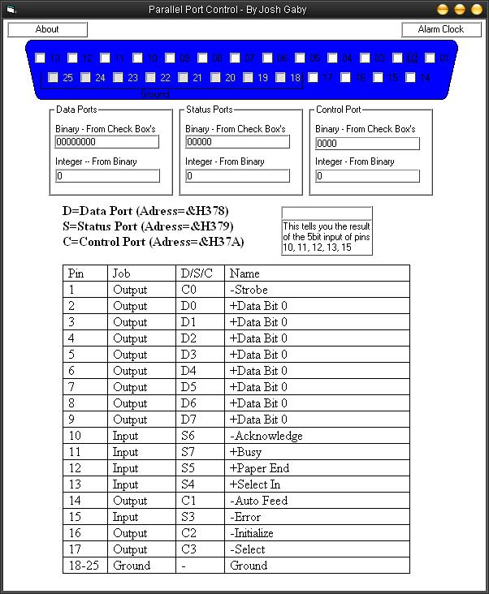



## Parallel Port Controller

### Description

The purpose of this program is to show how to use inpout32.dll to get input and output through your parallel port. This was created on XP pro so I presume that it will also work on XP home

To use this porgram you will need the inpout32.dll you can get it from : http://www.logix4u.net/inpout32_source_and_bins.zip
 
### More Info
 
To use this porgram you will need the inpout32.dll you can get it from : http://www.logix4u.net/inpout32_source_and_bins.zip

             |
---                |---
**Submitted On**   |2004-10-28 15:49:52
**By**             |[Synaptic Parsifal](https://github.com/Planet-Source-Code/PSCIndex/blob/master/ByAuthor/synaptic-parsifal.md)
**Level**          |Intermediate
**User Rating**    |4.7 (52 globes from 11 users)
**Compatibility**  |VB 6\.0
**Category**       |[Miscellaneous](https://github.com/Planet-Source-Code/PSCIndex/blob/master/ByCategory/miscellaneous__1-1.md)
**World**          |[Visual Basic](https://github.com/Planet-Source-Code/PSCIndex/blob/master/ByWorld/visual-basic.md)
**Archive File**   |[Parallel\_P18116110282004\.zip](https://github.com/Planet-Source-Code/synaptic-parsifal-parallel-port-controller__1-56967/archive/master.zip)

